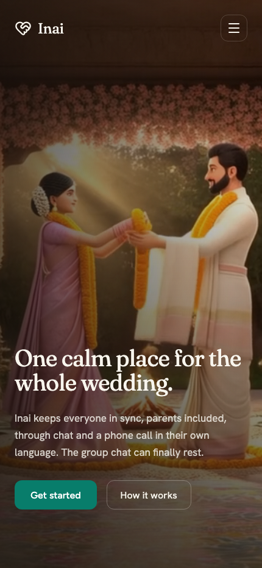

# Inai

One calm place for the whole wedding. Inai keeps family planning, decisions,
and updates together across chat and voice — reaching even the people who
will never install an app, in their own language.

Built on [SpacetimeDB](https://spacetimedb.com): state, logic, and real-time
sync all live in one database module. No separate backend server.

## Screenshots

<p align="center">
  
  
</p>

<p align="center"><em>Landing screen and sign-in sheet on mobile.</em></p>

The in-app screens (Today / Decide / Wedding tabs) live behind Google
sign-in — see [Features](#features) below for what's on each.

## The problem

Every wedding-planning app dies the same death: the data goes stale because
keeping it current is manual work nobody signs up for. Coordination actually
happens in the family WhatsApp group, one cousin's spreadsheet, and a
Pinterest board nobody else can edit.

**Inai's bet:** voice and chat aren't just query interfaces — they're the
*primary write path*. A coordinator keeps the wedding's state current by
talking to people, instead of waiting for someone to fill in a form. Humans
confirm; nothing acts on unconfirmed state.

## Competitor analysis

| | WedMeGood / WeddingWire India / ShaadiSaga | Inai |
|---|---|---|
| Core model | Vendor directory + lead generation | Coordination surface |
| Setup | Blank forms, one person fills them in | Ingest what already exists (calendar, quotes, chat exports) |
| Data entry | Manual, ongoing | Agent-drafted, confirmed by a human |
| Reaches parents / non-app relatives | No | Yes — inbound/outbound phone call, in their language |
| Guest travel & movement | Unmanaged | First-class: RSVP, travel, leaving times |
| Decision-making | Ad hoc in chat | A named decider locks a real outcome; votes are input, not binding democracy |
| Monetization incentive | Vendor leads — no reason to build coordination well | Coordination *is* the product |

The two structural gaps incumbents can't fill fast: reaching the
highest-coordination-load people who won't install anything (parents,
out-of-town relatives), and managing guest movement end-to-end.

## Design invariants

1. **Voice/chat writes, humans confirm.** No machine-extracted fact acts on
   the world until a human approves it, or a voice read-back gets a verbal
   yes.
2. **Every field carries provenance** — `source`, `updated_by`, `confidence`,
   `timestamp`, and a `reported → confirmed` state.
3. **Bots can be Responsible, never Accountable.** A bot chases, drafts, and
   aggregates. A human approves every decision, spend, and commitment.
4. **The agent contacts a person only about items that person owns.** No
   open owned item, no contact — this is what keeps the product from
   becoming spam.
5. **Ingest, don't ask.** Onboarding pulls structure from what the couple
   already has instead of an empty form.
6. **SpacetimeDB stays deterministic.** Reducers decide *what*; voice, LLM
   extraction, and maps live outside the module.

## Features

### Live and real
SpacetimeDB tables + reducers, synced across every open tab in under a
second, no refresh:

- **Multi-wedding accounts** — `wedding` / `member` / invitation model;
  roles (Couple, Planner, Family, Guest) with bride/groom side scoping
- **Persistent, cross-device login** via SpacetimeAuth (Google) — the same
  identity follows you across devices, not just one browser
- **Decisions** — proposal → vote → a *named decider* locks the final
  outcome; votes are input, not binding democracy
- **Tasks** — owner, due date, and a confirm/reported state machine (a
  voice-reported "done" doesn't count until a human confirms it)
- **Budget & expenses**, **vendors** (with a consent flag before any bot may
  contact one), **mood board**, **guest list**, **event checklists**,
  **group chat**
- **In-app Coordinator drafting** — a real OpenAI-backed serverless endpoint
  (`api/coordinator/draft.ts`) drafts a reminder/follow-up/summary for a
  human to review and send. It only ever produces a draft; it never sends a
  message or changes confirmed state.
- **Voice-agent contract** — four working HTTP endpoints on the SpacetimeDB
  module (`voice/context`, `voice/report-task-done`, `voice/call-suggestion`,
  `voice/action`) that a Sarvam voice agent calls during a live phone call,
  scoped to the caller's own phone-linked identity and open items. See
  [`docs/sarvam-voice-agents.md`](docs/sarvam-voice-agents.md) for the full
  agent configuration.

### Modeled, not yet functionally real
- **File-based ingestion** (`src/lib/ingest.ts`) does real `.ics` calendar
  parsing, but WhatsApp-export and vendor-quote parsing is regex/keyword
  matching — not an LLM or vision model reading the actual content.
- **"Coordinator requests"** create a task + a request row for a person;
  nothing autonomous currently reads and acts on that row end-to-end.

### Not started
- Guest self-service RSVP (currently seed/couple-entered only)
- Scheduled nudges (no `Schedule` table — nothing fires on a timer yet)
- Leaving-time computation / maps integration (marketing copy only)
- Photo timeline (explicitly deprioritized in the spec)
- An actual configured, live Sarvam voice agent (the module-side contract is
  done; the agent itself needs to be built in Sarvam's dashboard)

## Go-to-market

**Wedge:** the populated-in-minutes onboarding moment (point Inai at a
calendar export or a few quotes and the surface is already alive) plus one
working inbound voice call answering real questions from live data — the two
moments that make a room go quiet, per the product's own Phase 0 cut.

**Beachhead:** urban Indian weddings with an extended family split across
cities and at least one non-resident relative — the exact shape of
coordination load incumbents structurally can't serve, since they monetize
vendor leads and have no reason to build the coordination layer.

**Channel:** the couple is the buyer and the first user; distribution is
viral by construction — every family member and vendor they invite is a new
user who experiences the product without ever downloading anything extra
(guests and phone-only parents need zero install).

**Expansion:** once the coordination surface is trusted for one wedding, the
same shared-state model generalizes to other multi-generational, multi-party
event categories (large milestone birthdays, multi-day religious functions)
with the same "six places at once" problem.

**Moat:** the confirmation-gate + provenance model is what lets a family
actually trust an AI touching their daughter's wedding — that trust, not the
LLM wrapper, is the hard-to-copy part.

## Specs

- **State & backend:** [SpacetimeDB](https://spacetimedb.com) — a TypeScript
  module (`spacetimedb/src/index.ts`) is the single source of truth: 26
  tables, ~55 reducers/HTTP handlers, every client update arrives through
  live subscriptions.
- **Frontend:** React 18 + Vite, deployed as a static SPA; `spacetimedb/react`
  hooks (`useTable`, `useReducer`, `useSpacetimeDB`) drive every screen
  directly off the database.
- **Auth:** [SpacetimeAuth](https://spacetimedb.com/docs/core-concepts/authentication/spacetimeauth/)
  (Google identity provider) via `react-oidc-context` — a real OIDC ID
  token, not the SDK's anonymous per-browser token, so identity persists
  across devices.
- **AI drafting:** a Vercel serverless function (`api/coordinator/draft.ts`)
  calling OpenAI's Responses API, kept strictly to draft generation — see
  [Design invariants](#design-invariants) for why it can't do more than that.
- **Voice:** designed for [Sarvam](https://sarvam.ai) Voice Agents (Saaras
  STT / Bulbul TTS) calling back into the SpacetimeDB module's HTTP routes;
  full agent configuration in
  [`docs/sarvam-voice-agents.md`](docs/sarvam-voice-agents.md).
- **Determinism boundary:** reducers never touch the network, a clock, or
  randomness — SpacetimeDB-provided `ctx.timestamp`/`ctx.random` only. Voice,
  LLM extraction, and maps calls all live outside the module and write
  results back through reducers.
- **Full product spec:** [`docs/inai-projct-spec.md`](docs/inai-projct-spec.md).

## Development setup

### Prerequisites

- [Node.js](https://nodejs.org/) 18+
- [SpacetimeDB CLI](https://spacetimedb.com/install)

### Run it

```bash
npm install
spacetime start                    # local SpacetimeDB, or target --server maincloud
npm run spacetime:publish:local    # publish the module
npm run spacetime:generate         # generate TypeScript client bindings
npm run dev                        # start the Vite dev server
```

Set `VITE_SPACETIME_AUTH_CLIENT_ID` in `.env` (see `.env.example`) to enable
Google sign-in locally.

### Project structure

```
sift/
├── spacetimedb/src/index.ts   # The module: tables, reducers, HTTP handlers
├── src/
│   ├── components/            # Screens (Hero, AppShell, TodayTab, DecisionBoard, ...)
│   ├── lib/ingest.ts           # Calendar/quote/WhatsApp-export parsing
│   └── module_bindings/       # Auto-generated SpacetimeDB client types
├── api/coordinator/draft.ts   # Vercel function: OpenAI-backed draft generation
└── docs/
    ├── inai-projct-spec.md    # Full product spec
    └── sarvam-voice-agents.md # Voice agent configuration
```

### Deploy the in-app Coordinator on Vercel

The Vercel function at `POST /api/coordinator/draft` generates an in-app
draft only. It never sends a message or changes confirmed wedding state.

1. In Vercel, open the project's **Settings → Environment Variables**.
2. Add `OPENAI_API_KEY` for **Production** (and Preview if you use previews).
3. Optionally add `OPENAI_MODEL` (defaults to `gpt-4.1-mini`).
4. Deploy the project.

Do not use a `VITE_` prefix for that key — those values are bundled into the
browser. Server-side secrets stay server-side.

### Further reading

- [SpacetimeDB Chat App Tutorial](https://spacetimedb.com/docs/intro/tutorials/chat-app)
- [SpacetimeDB TypeScript SDK Reference](https://spacetimedb.com/docs/intro/core-concepts/clients/typescript-reference)
- [Sarvam Voice Agents configuration](docs/sarvam-voice-agents.md)
